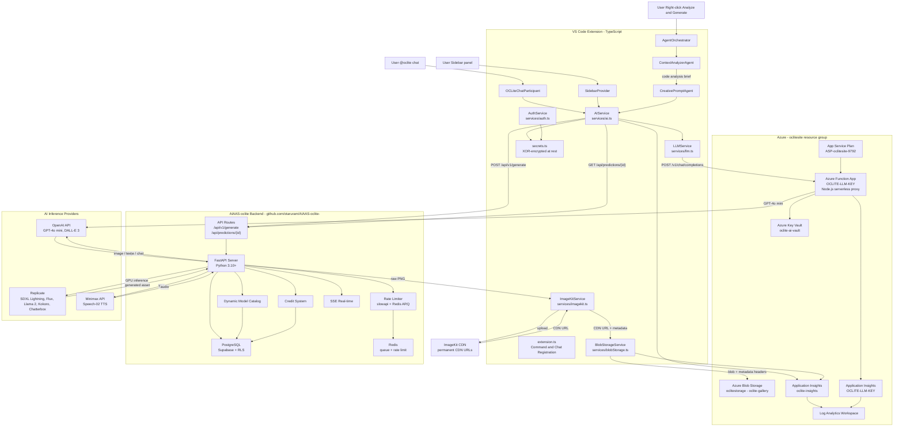

# OCLite VS Code Extension - Architecture

> **Document type:** Technical Architecture Reference
> **Product:** OCLite Copilot Extension (`oclitesite.oclite-vscode`)
> **AI Backend:** [AIAAS-oclite](https://github.com/otaruram/AIAAS-oclite-) - OCLite Modern AI SaaS Platform
> **Last reviewed:** February 2026

This document describes the end-to-end architecture of the OCLite VS Code Extension, its integration with the [AIAAS-oclite AI backend](https://github.com/otaruram/AIAAS-oclite-), and the supporting Azure cloud infrastructure.

---

## 1. System Overview

OCLite is built on a **cloud-native, serverless architecture** that separates concerns into three layers:

| Layer | Responsibility |
| :--- | :--- |
| **VS Code Extension** (this repo) | User interface, agent orchestration, workspace integration |
| **AIAAS-oclite Backend** ([GitHub](https://github.com/otaruram/AIAAS-oclite-)) | FastAPI AI inference engine, credit system, model catalog |
| **Azure Cloud Infrastructure** | Secrets management, blob storage, telemetry, serverless proxy |

---

## 2. AI Backend - AIAAS-oclite

The AI engine for this extension is the **[AIAAS-oclite](https://github.com/otaruram/AIAAS-oclite-)** project - a production-grade, containerized AI-as-a-Service platform built with Python FastAPI.

### What AIAAS-oclite Provides

| Capability | Detail |
| :--- | :--- |
| **Image Generation** | SDXL Lightning, Flux Dev/Schnell, DALL-E 3 (via Replicate) |
| **Text / Chat (LLM)** | GPT-4o mini, Llama 2 (via OpenAI / Replicate) |
| **Audio / TTS** | Kokoro 82M, Chatterbox, Speech-02 (via Replicate / Minimax) |
| **Credit System** | Per-user credit balance; every generation deducts credits |
| **RBAC** | Admin (dashboard + user management) and User (playground + history) roles |
| **Dynamic Model Catalog** | Models stored in PostgreSQL - hot-swappable without redeployment |
| **Rate Limiting** | `slowapi` (per-user & global) + Redis-backed queue via ARQ |
| **Authentication** | UUIDv4 API Keys + JWT headers; scoped per user |
| **SSE Real-time** | Server-Sent Events for live generation progress |
| **Webhook Security** | HMAC-signed webhook callbacks |

### AIAAS-oclite Tech Stack

| Layer | Technology |
| :--- | :--- |
| Framework | FastAPI (Python 3.10+) |
| Database | PostgreSQL via Supabase (Row-Level Security) |
| ORM | Prisma Client Python |
| Queue | ARQ (async task queue backed by Redis) |
| Container | Docker + Docker Compose |
| CI/CD | GitHub Actions to GHCR (`oclite-backend` image) |
| Frontend (web) | React 18 + Vite + TypeScript + Tailwind CSS + ShadCN |

---

## 3. Azure Cloud Infrastructure

The following Azure resources (visible in the `oclitesite` resource group) support this extension:

| Azure Resource | Name | Role |
| :--- | :--- | :--- |
| **Storage Account** | `oclitestorage` | Blob storage for generated images & metadata (`oclite-gallery` container) |
| **Application Insights** | `oclite-insights` | Telemetry, error tracking, and usage analytics |
| **Application Insights** | `OCLITE-LLM-KEY` | Instrumentation for the LLM proxy Function App |
| **Function App** | `OCLITE-LLM-KEY` | Serverless Node.js proxy - routes LLM requests to GPT-4o mini |
| **Key Vault** | `oclite-ai-vault` | Stores all secrets: API keys, SAS tokens, ImageKit credentials |
| **Log Analytics Workspace** | `cd70d657-...` | Aggregates logs from Functions and App Insights |
| **App Service Plan** | `ASP-oclitesite-9792` | Compute plan for the Function App |
| **Resource Group** | `oclitesite` | Logical container for all above resources (Canada Central / East US) |

---

## 4. End-to-End Data Flow

### 4.1 Mermaid Diagram - Full System

### 4.2 Step-by-Step Narrative

1. **User enters a prompt** via the `@oclite` chat participant or the sidebar panel.
   Alternatively, right-click a file or folder and select **"OCLite: Analyze & Generate Assets"** to trigger the multi-agent pipeline.

2. **Context Analyzer Agent** (`ContextAnalyzerAgent.ts`) reads workspace source files using `vscode.workspace.findFiles()` and extracts entities that need visual assets (characters, UI elements, environments).

3. **Creative Prompt Agent** (`CreativePromptAgent.ts`) receives the code analysis brief and transforms it into a detailed, SDXL-optimized image generation prompt.

4. **AIService** (`services/ai.ts`) calls `refinePrompt()` which:
   - Reads encrypted secrets from `secrets.ts`
   - Sends the prompt to the **Azure Function App** (`OCLITE-LLM-KEY`) via `POST /v1/chat/completions`

5. **Azure Function App** (serverless proxy):
   - Fetches live API keys from **Azure Key Vault** (`oclite-ai-vault`)
   - Forwards the request to **OpenAI / GPT-4o mini**
   - Emits telemetry to **Application Insights** (`OCLITE-LLM-KEY`)
   - Returns the refined prompt back to the extension

6. **AIService** sends `POST /api/v1/generate` to the **AIAAS-oclite FastAPI backend** with the refined prompt and selected model.

7. **AIAAS-oclite Backend** ([GitHub](https://github.com/otaruram/AIAAS-oclite-)):
   - Validates API key and JWT headers
   - Deducts credits from the **Credit System** (PostgreSQL)
   - Checks **Rate Limiter** (slowapi + Redis ARQ queue)
   - Routes request to the correct AI provider:
     - Images: Replicate (SDXL Lightning, Flux Dev/Schnell) or OpenAI (DALL-E 3)
     - Text/Chat: OpenAI (GPT-4o mini) or Replicate (Llama 2)
     - Audio/TTS: Replicate (Kokoro 82M, Chatterbox) or Minimax (Speech-02)
   - Streams real-time progress via **SSE** (Server-Sent Events)
   - Validates completion callbacks via **HMAC-signed webhooks**

8. **Extension polls** `GET /api/predictions/{id}` until status is `succeeded`.

9. **ImageKit Service** (`services/imagekit.ts`) uploads the raw PNG to **ImageKit CDN** (60 s timeout, 3 automatic retries with linear backoff). Returns a permanent CDN URL.

10. **Blob Storage Service** (`services/blobStorage.ts`) writes the blob with ASCII-sanitized metadata headers (prompt, model, user, ImageKit URL) to **Azure Blob Storage** (`oclitestorage` > `oclite-gallery` container).

11. **Extension** presents the final CDN URL to the user. `AIService.generateName()` calls GPT-4o mini (via the Function App) to suggest a `snake_case` filename. User previews or saves to workspace.

12. **Application Insights** (`oclite-insights`) collects telemetry from the extension and blob/CDN operations; all logs are aggregated in the **Log Analytics Workspace**.

---

## 5. Intelligence Layer - Agentic Reasoning

### Prompt Engineering Orchestration

The extension uses **GPT-4o mini** as its reasoning engine routed through the serverless **Azure Function App proxy**. When a user submits a short description, the LLM analyzes intent and generates a professional SDXL prompt - determining style, color palette, lighting, composition, and quality tags.

If the Function App or LLM is unavailable, the system falls back to local prompt enhancement using category-specific presets.

### Context-Aware Workspace Detection

`AIService.getWorkspaceSuggestion()` scans the workspace and maps file patterns to project types:

| File Pattern | Project Type | Suggested Style |
| :--- | :--- | :--- |
| `*.unity`, `Assets/**/*.cs` | Unity | Character / Texture |
| `*.uproject` | Unreal Engine | Environment / Texture |
| `project.godot` | Godot | Pixel Art |
| `package.json` with `react` | React | UI Icon |
| `package.json` with `vue` | Vue.js | UI Icon |
| `package.json` with `@angular/core` | Angular | UI Icon |
| `*.py` | Python | Vector |

### Smart Auto-Naming

File names are generated by GPT-4o mini from prompt content (e.g., `cyberpunk_cityscape_01.png`). On failure, keywords are extracted and formatted as `snake_case` with versioning.

---

## 6. Component Reference

### `src/extension.ts`

- Registers the `@oclite` chat participant with the VS Code Chat API.
- Registers commands: `oclite.setApiKey`, `oclite.saveImage`, `oclite.previewImage`, `oclite.analyzeAndGenerate`.
- Orchestrates the full generation flow: LLM refinement > image generation > polling > CDN upload > save.

### `src/agents/`

| File | Role |
| :--- | :--- |
| `AgentOrchestrator.ts` | Coordinates the multi-agent pipeline; dispatches tasks to sub-agents |
| `ContextAnalyzerAgent.ts` | Reads source files, identifies entities needing visual assets |
| `CreativePromptAgent.ts` | Converts code analysis brief into detailed image-generation prompts |

### `src/services/`

| File | Role |
| :--- | :--- |
| `ai.ts` | `refinePrompt()`, `generateName()`, `getWorkspaceSuggestion()` |
| `llm.ts` | Single LLM gateway - wraps HTTP calls to the Azure Function proxy |
| `auth.ts` | API key management - reads from VS Code Secret Storage |
| `blobStorage.ts` | Azure Blob Storage upload with metadata sanitization |
| `imagekit.ts` | ImageKit CDN upload with retry logic (3x linear backoff) |
| `rateLimit.ts` | Client-side rate limit guard |
| `sharing.ts` | Generates shareable image links |
| `telemetry.ts` | Application Insights SDK integration |

### `src/panels/`

| File | Role |
| :--- | :--- |
| `SidebarProvider.ts` | WebviewViewProvider - sidebar UI, polling, save-to-workspace |
| `ChatProvider.ts` | Chat participant message handler |

### `src/utilities/`

| File | Role |
| :--- | :--- |
| `secrets.ts` | XOR-encrypted secret store (excluded from version control) |
| `getNonce.ts` | Cryptographic nonce for Content Security Policy |
| `getUri.ts` | Resolves webview-safe URIs for local resources |

---

## 7. API Endpoint Reference

### LLM Proxy (Azure Function App)

| Method | Endpoint | Purpose |
| :--- | :--- | :--- |
| `POST` | `https://<function-app>.azurewebsites.net/v1/chat/completions` | GPT-4o mini prompt refinement and smart naming |

### AIAAS-oclite Image Generation

| Method | Endpoint | Purpose |
| :--- | :--- | :--- |
| `POST` | `/api/v1/generate` | Start image generation job |
| `GET` | `/api/predictions/{id}` | Poll generation status |

All endpoints require `Authorization: Bearer <api-key>` and `X-User-ID` headers.

---

## 8. Security

All secrets (Azure Blob SAS URL, ImageKit credentials, OCLite API key) are **XOR-encrypted at rest** in `src/utilities/secrets.ts` and decrypted at runtime. The file is excluded from version control via `.gitignore`. The production bundle (`dist/extension.js`) is verified after each build to confirm no plaintext secrets are present.

Azure Key Vault (`oclite-ai-vault`) provides the authoritative secret store for the serverless proxy layer. All metadata values stored in Azure Blob Storage are sanitized to ASCII-only (0x20-0x7E) before upload to prevent header injection.

---

## 9. CI/CD Pipeline

1. Push to `main` triggers GitHub Actions.
2. TypeScript compilation (`tsc`) and linting.
3. Automated packaging via `vsce package`.
4. Publishing to the VS Code Marketplace.

---

## 10. Technical Specification

| Component | Technology | Role |
| :--- | :--- | :--- |
| AI Backend | [AIAAS-oclite FastAPI](https://github.com/otaruram/AIAAS-oclite-) | Image, text, and audio inference + credit system |
| LLM Brain | GPT-4o mini (OpenAI) | Prompt refinement & agent reasoning |
| Image Models | SDXL Lightning, Flux Dev/Schnell, DALL-E 3 | High-fidelity asset generation |
| Audio/TTS | Kokoro 82M, Chatterbox, Speech-02 | Voice synthesis |
| Serverless Proxy | Azure Functions (Node.js) - OCLITE-LLM-KEY | Stateless LLM request routing |
| Secrets Management | Azure Key Vault - oclite-ai-vault | Secure runtime secret retrieval |
| Blob Storage | Azure Blob Storage - oclitestorage | Image metadata & PNG backup |
| CDN | ImageKit | Fast, permanent image delivery |
| Telemetry | Azure Application Insights - oclite-insights | Error tracking & usage analytics |
| Log Aggregation | Azure Log Analytics Workspace | Unified observability |
| Database | PostgreSQL (Supabase) + Prisma | User data, credits, model catalog |
| Queue | Redis + ARQ | Async task management & rate limiting |
| UI Framework | VS Code Webview UI Toolkit | Native VS Code sidebar experience |
| Extension Language | TypeScript | All extension source code |
| HTTP Client | Axios | API communication |
| Build | TypeScript Compiler (tsc) + Webpack | Bundle and compilation |
| Container | Docker + Docker Compose | AIAAS-oclite backend deployment |
